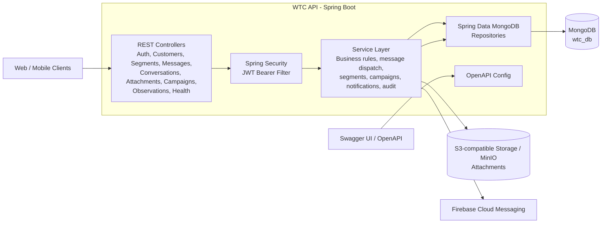

# Architecture Diagram Prompt

Use this prompt in a diagramming AI tool, whiteboard generator, or image generation tool to create an architecture diagram for this project.

```text
Create a clean software architecture diagram for a backend project named "WTC API".

The project is a Java 17 Spring Boot backend application. Show it as a layered REST API architecture with these main parts:

1. External clients
   - Web/mobile clients
   - Swagger UI / OpenAPI documentation consumers

2. API layer
   - Spring MVC REST Controllers
   - Main endpoint groups:
     - Authentication: login and register
     - Customers: create, find by ID, list/filter customers
     - Segments: create segments, list segments, list customers in a segment
     - Messages: send messages and list conversation message history
     - Conversations: list conversations by customer
     - Attachments: upload/download attachment files
     - Campaigns: campaign management
     - Observations: customer observations/notes
     - Health: service health endpoint

3. Security layer
   - Spring Security
   - JWT bearer token authentication
   - Security filter validates the Authorization header
   - Public endpoints: auth login/register, Swagger UI, OpenAPI JSON
   - Protected endpoints require a valid JWT

4. Application/service layer
   - AuthService and TokenService
   - CustomerService
   - Segment services
   - Message services:
     - SendMessageService
     - ListMessageService
     - MessageDispatcher
     - ChatMessageService
   - Conversation services
   - CampaignService
   - AttachmentService and S3Service
   - AuditService
   - Notification service / FCM service
   - Customer observation services

5. Persistence layer
   - Spring Data MongoDB repositories
   - Repositories for users, customers, segments, messages, conversations, campaigns, attachments, audit logs, and observations
   - MongoDB database named wtc_db

6. External infrastructure
   - MongoDB Atlas or MongoDB database for application data
   - S3-compatible object storage / MinIO for attachments
   - Firebase Cloud Messaging for notifications
   - Swagger/OpenAPI generated documentation

Show the main request flow:
Client -> REST Controller -> JWT Security Filter -> Service Layer -> Repository Layer -> MongoDB

Show the attachment flow:
Client -> Attachment Controller -> Attachment Service -> S3 Service -> S3-compatible storage / MinIO

Show the notification flow:
Message or campaign service -> Notification Service / FCM Service -> Firebase Cloud Messaging -> End user device

Show the audit/logging flow:
Controllers or services -> Logging/Audit components -> Audit repository -> MongoDB

Design requirements:
- Use a professional, simple, readable architecture diagram style.
- Use grouped boxes for layers.
- Use arrows to show data flow.
- Put external systems outside the Spring Boot application boundary.
- Label the central application boundary as "WTC API - Spring Boot".
- Use distinct colors for clients, application layers, database/storage, and external services.
- Keep the diagram high level, not class-by-class.
- Make it suitable for a README or project presentation.
```

## Optional Mermaid Version


